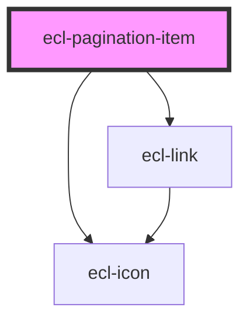

# ecl-pagination

<!-- Auto Generated Below -->

## Properties

| Property     | Attribute     | Description | Type      | Default     |
| ------------ | ------------- | ----------- | --------- | ----------- |
| `ariaLabel`  | `aria-label`  |             | `string`  | `undefined` |
| `current`    | `current`     |             | `boolean` | `undefined` |
| `next`       | `next`        |             | `boolean` | `undefined` |
| `path`       | `path`        |             | `string`  | `undefined` |
| `previous`   | `previous`    |             | `boolean` | `undefined` |
| `styleClass` | `style-class` |             | `string`  | `''`        |
| `theme`      | `theme`       |             | `string`  | `'ec'`      |

## Dependencies

### Depends on

- [ecl-link](../ecl-link)
- [ecl-icon](../ecl-icon)

### Graph

----------------------------------------------

*Built with [StencilJS](https://stenciljs.com/)*
