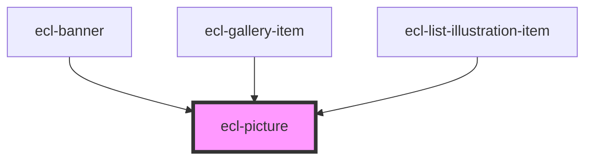

# ecl-picture

<!-- Auto Generated Below -->

## Properties

| Property     | Attribute     | Description | Type     | Default     |
| ------------ | ------------- | ----------- | -------- | ----------- |
| `image`      | `image`       |             | `string` | `undefined` |
| `imageAlt`   | `image-alt`   |             | `string` | `undefined` |
| `imgClass`   | `img-class`   |             | `string` | `undefined` |
| `styleClass` | `style-class` |             | `string` | `''`        |
| `theme`      | `theme`       |             | `string` | `'ec'`      |

## Dependencies

### Used by

 - [ecl-banner](../ecl-banner)
 - [ecl-gallery-item](../ecl-gallery)
 - [ecl-list-illustration-item](../ecl-list-illustration)

### Graph

----------------------------------------------

*Built with [StencilJS](https://stenciljs.com/)*
