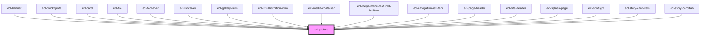

# ecl-picture

<!-- Auto Generated Below -->

## Properties

| Property      | Attribute      | Description | Type      | Default     |
| ------------- | -------------- | ----------- | --------- | ----------- |
| `image`       | `image`        |             | `string`  | `undefined` |
| `imageAlt`    | `image-alt`    |             | `string`  | `undefined` |
| `imageAnchor` | `image-anchor` |             | `string`  | `'center'`  |
| `imgClass`    | `img-class`    |             | `string`  | `undefined` |
| `lazy`        | `lazy`         |             | `boolean` | `false`     |
| `styleClass`  | `style-class`  |             | `string`  | `''`        |
| `theme`       | `theme`        |             | `string`  | `undefined` |
| `zoom`        | `zoom`         |             | `boolean` | `false`     |

## Dependencies

### Used by

 - [ecl-banner](../ecl-banner)
 - [ecl-blockquote](../ecl-blockquote)
 - [ecl-card](../ecl-card)
 - [ecl-file](../ecl-file)
 - [ecl-footer-ec](../ecl-footer)
 - [ecl-footer-eu](../ecl-footer)
 - [ecl-gallery-item](../ecl-gallery)
 - [ecl-list-illustration-item](../ecl-list-illustration)
 - [ecl-media-container](../ecl-media-container)
 - [ecl-mega-menu-featured-list-item](../ecl-mega-menu)
 - [ecl-navigation-list-item](../ecl-navigation-list)
 - [ecl-page-header](../ecl-page-header)
 - [ecl-site-header](../ecl-site-header)
 - [ecl-splash-page](../ecl-splash-page)
 - [ecl-spotlight](../ecl-spotlight)
 - [ecl-story-card-item](../ecl-story-card)
 - [ecl-story-card-tab](../ecl-story-card)

### Graph

```mermaid
graph TD;
  ecl-banner --> ecl-picture
  ecl-blockquote --> ecl-picture
  ecl-card --> ecl-picture
  ecl-file --> ecl-picture
  ecl-footer-ec --> ecl-picture
  ecl-footer-eu --> ecl-picture
  ecl-gallery-item --> ecl-picture
  ecl-list-illustration-item --> ecl-picture
  ecl-media-container --> ecl-picture
  ecl-mega-menu-featured-list-item --> ecl-picture
  ecl-navigation-list-item --> ecl-picture
  ecl-page-header --> ecl-picture
  ecl-site-header --> ecl-picture
  ecl-splash-page --> ecl-picture
  ecl-spotlight --> ecl-picture
  ecl-story-card-item --> ecl-picture
  ecl-story-card-tab --> ecl-picture
  style ecl-picture fill:#f9f,stroke:#333,stroke-width:4px
```

----------------------------------------------

*Built with [StencilJS](https://stenciljs.com/)*
