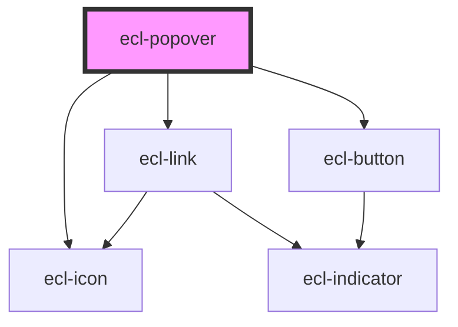

# ecl-popover-item

<!-- Auto Generated Below -->

## Properties

| Property         | Attribute         | Description | Type      | Default     |
| ---------------- | ----------------- | ----------- | --------- | ----------- |
| `close`          | `close`           |             | `boolean` | `false`     |
| `eclScript`      | `ecl-script`      |             | `boolean` | `true`      |
| `icon`           | `icon`            |             | `string`  | `undefined` |
| `indicator`      | `indicator`       |             | `boolean` | `false`     |
| `indicatorValue` | `indicator-value` |             | `number`  | `undefined` |
| `itemId`         | `item-id`         |             | `string`  | `undefined` |
| `styleClass`     | `style-class`     |             | `string`  | `undefined` |
| `theme`          | `theme`           |             | `string`  | `undefined` |
| `toggleLabel`    | `toggle-label`    |             | `string`  | `undefined` |

## Dependencies

### Depends on

- [ecl-link](../ecl-link)
- [ecl-icon](../ecl-icon)
- [ecl-button](../ecl-button)

### Graph

```mermaid
graph TD;
  ecl-popover --> ecl-link
  ecl-popover --> ecl-icon
  ecl-popover --> ecl-button
  ecl-link --> ecl-icon
  ecl-link --> ecl-indicator
  ecl-button --> ecl-indicator
  style ecl-popover fill:#f9f,stroke:#333,stroke-width:4px
```

----------------------------------------------

*Built with [StencilJS](https://stenciljs.com/)*
