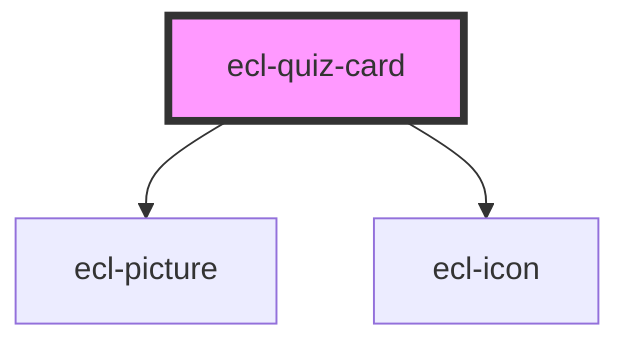

# ecl-quiz

<!-- Auto Generated Below -->

## Properties

| Property               | Attribute                | Description | Type     | Default                                                          |
| ---------------------- | ------------------------ | ----------- | -------- | ---------------------------------------------------------------- |
| `answer`               | `answer`                 |             | `string` | `undefined`                                                      |
| `answerTitle`          | `answer-title`           |             | `string` | `undefined`                                                      |
| `backText`             | `back-text`              |             | `string` | `undefined`                                                      |
| `correctChosenLabel`   | `correct-chosen-label`   |             | `string` | `''`                                                             |
| `correctLabel`         | `correct-label`          |             | `string` | `''`                                                             |
| `flipText`             | `flip-text`              |             | `string` | `undefined`                                                      |
| `image`                | `image`                  |             | `string` | `undefined`                                                      |
| `imageAlt`             | `image-alt`              |             | `string` | `undefined`                                                      |
| `imageDisplay`         | `image-display`          |             | `string` | `undefined`                                                      |
| `incorrectChosenLabel` | `incorrect-chosen-label` |             | `string` | `''`                                                             |
| `incorrectLabel`       | `incorrect-label`        |             | `string` | `''`                                                             |
| `itemId`               | `item-id`                |             | `string` | `` `ecl-quiz-item-${Math.random().toString(36).substr(2, 9)}` `` |
| `mainIcon`             | `main-icon`              |             | `string` | `undefined`                                                      |
| `options`              | `options`                |             | `string` | `undefined`                                                      |
| `question`             | `question`               |             | `string` | `undefined`                                                      |
| `quizName`             | `quiz-name`              |             | `string` | `undefined`                                                      |
| `skipText`             | `skip-text`              |             | `string` | `undefined`                                                      |
| `styleClass`           | `style-class`            |             | `string` | `undefined`                                                      |
| `theme`                | `theme`                  |             | `string` | `undefined`                                                      |
| `variant`              | `variant`                |             | `string` | `'reveal'`                                                       |

## Dependencies

### Depends on

- [ecl-picture](../ecl-picture)
- [ecl-icon](../ecl-icon)

### Graph

----------------------------------------------

*Built with [StencilJS](https://stenciljs.com/)*
