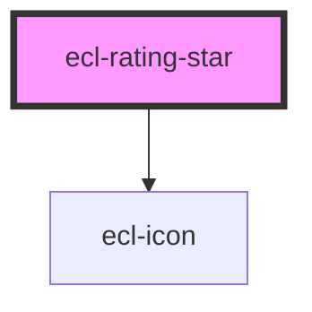

# ecl-rating-field-item

<!-- Auto Generated Below -->

## Properties

| Property     | Attribute     | Description | Type      | Default          |
| ------------ | ------------- | ----------- | --------- | ---------------- |
| `checked`    | `checked`     |             | `boolean` | `false`          |
| `disabled`   | `disabled`    |             | `boolean` | `false`          |
| `hasChanged` | `has-changed` |             | `boolean` | `false`          |
| `icon`       | `icon`        |             | `string`  | `'star-outline'` |
| `iconFilled` | `icon-filled` |             | `string`  | `'star-filled'`  |
| `isFocused`  | `is-focused`  |             | `boolean` | `false`          |
| `itemId`     | `item-id`     |             | `string`  | `undefined`      |
| `label`      | `label`       |             | `string`  | `undefined`      |
| `name`       | `name`        |             | `string`  | `undefined`      |
| `required`   | `required`    |             | `boolean` | `false`          |
| `styleClass` | `style-class` |             | `string`  | `undefined`      |
| `theme`      | `theme`       |             | `string`  | `'ec'`           |
| `value`      | `value`       |             | `string`  | `undefined`      |

## Events

| Event         | Description | Type                      |
| ------------- | ----------- | ------------------------- |
| `inputBlur`   |             | `CustomEvent<FocusEvent>` |
| `inputChange` |             | `CustomEvent<any>`        |
| `inputFocus`  |             | `CustomEvent<FocusEvent>` |

## Dependencies

### Depends on

- [ecl-icon](../ecl-icon)

### Graph

----------------------------------------------

*Built with [StencilJS](https://stenciljs.com/)*
