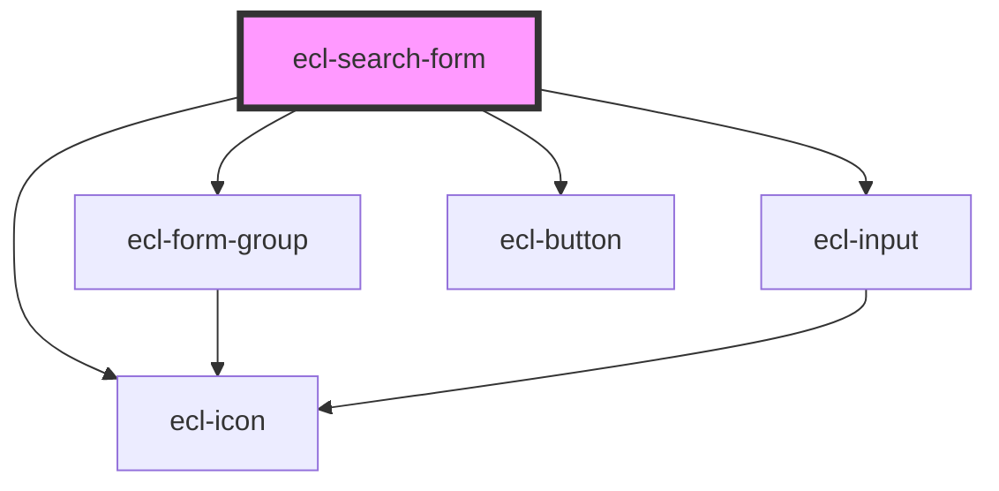

# ecl-search-form

<!-- Auto Generated Below -->

## Properties

| Property          | Attribute           | Description | Type      | Default     |
| ----------------- | ------------------- | ----------- | --------- | ----------- |
| `buttonAriaLabel` | `button-aria-label` |             | `string`  | `undefined` |
| `buttonLabel`     | `button-label`      |             | `string`  | `undefined` |
| `disabled`        | `disabled`          |             | `boolean` | `false`     |
| `helperId`        | `helper-id`         |             | `string`  | `undefined` |
| `helperText`      | `helper-text`       |             | `string`  | `undefined` |
| `inputId`         | `input-id`          |             | `string`  | `undefined` |
| `invalid`         | `invalid`           |             | `boolean` | `false`     |
| `invalidText`     | `invalid-text`      |             | `string`  | `undefined` |
| `label`           | `label`             |             | `string`  | `undefined` |
| `name`            | `name`              |             | `string`  | `undefined` |
| `placeholder`     | `placeholder`       |             | `string`  | `undefined` |
| `required`        | `required`          |             | `boolean` | `false`     |
| `styleClass`      | `style-class`       |             | `string`  | `undefined` |
| `theme`           | `theme`             |             | `string`  | `'ec'`      |
| `type`            | `type`              |             | `string`  | `undefined` |
| `width`           | `width`             |             | `string`  | `'m'`       |

## Dependencies

### Depends on

- [ecl-form-group](../ecl-form-group)
- [ecl-input](../ecl-input)
- [ecl-button](../ecl-button)
- [ecl-icon](../ecl-icon)

### Graph

----------------------------------------------

*Built with [StencilJS](https://stenciljs.com/)*
