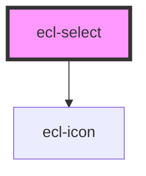

# ecl-select

<!-- Auto Generated Below -->

## Properties

| Property                      | Attribute                         | Description | Type      | Default     |
| ----------------------------- | --------------------------------- | ----------- | --------- | ----------- |
| `disabled`                    | `disabled`                        |             | `boolean` | `false`     |
| `eclScript`                   | `ecl-script`                      |             | `boolean` | `false`     |
| `hasChanged`                  | `has-changed`                     |             | `boolean` | `false`     |
| `inputValue`                  | `input-value`                     |             | `string`  | `undefined` |
| `invalid`                     | `invalid`                         |             | `boolean` | `false`     |
| `multiple`                    | `multiple`                        |             | `boolean` | `false`     |
| `multipleAllText`             | `multiple-all-text`               |             | `string`  | `undefined` |
| `multipleClearAllText`        | `multiple-clear-all-text`         |             | `string`  | `undefined` |
| `multipleCloseText`           | `multiple-close-text`             |             | `string`  | `undefined` |
| `multiplePlaceholder`         | `multiple-placeholder`            |             | `string`  | `undefined` |
| `multipleSearchNoResultsText` | `multiple-search-no-results-text` |             | `string`  | `undefined` |
| `multipleSearchText`          | `multiple-search-text`            |             | `string`  | `undefined` |
| `name`                        | `name`                            |             | `string`  | `undefined` |
| `required`                    | `required`                        |             | `boolean` | `false`     |
| `selectId`                    | `select-id`                       |             | `string`  | `undefined` |
| `styleClass`                  | `style-class`                     |             | `string`  | `undefined` |
| `theme`                       | `theme`                           |             | `string`  | `'ec'`      |
| `width`                       | `width`                           |             | `string`  | `'m'`       |

## Events

| Event         | Description | Type                      |
| ------------- | ----------- | ------------------------- |
| `inputBlur`   |             | `CustomEvent<FocusEvent>` |
| `inputChange` |             | `CustomEvent<any>`        |
| `inputFocus`  |             | `CustomEvent<FocusEvent>` |

## Dependencies

### Depends on

- [ecl-icon](../ecl-icon)

### Graph

----------------------------------------------

*Built with [StencilJS](https://stenciljs.com/)*
