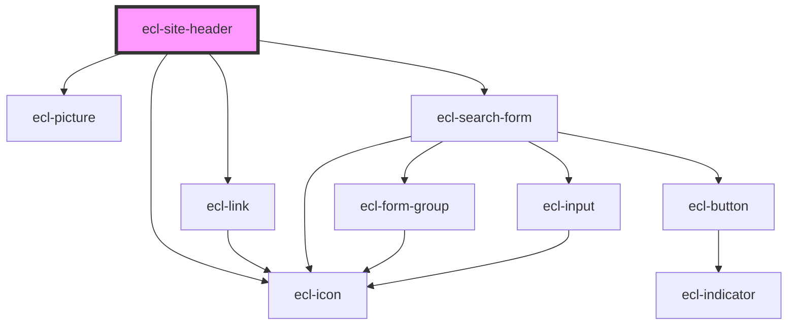

# ecl-site-header

<!-- Auto Generated Below -->

## Properties

| Property            | Attribute             | Description | Type      | Default     |
| ------------------- | --------------------- | ----------- | --------- | ----------- |
| `closeLabel`        | `close-label`         |             | `string`  | `undefined` |
| `eclScript`         | `ecl-script`          |             | `boolean` | `false`     |
| `euLabel`           | `eu-label`            |             | `string`  | `undefined` |
| `langCode`          | `lang-code`           |             | `string`  | `undefined` |
| `language`          | `language`            |             | `string`  | `undefined` |
| `languageAriaLabel` | `language-aria-label` |             | `string`  | `undefined` |
| `languageBlock`     | `language-block`      |             | `boolean` | `false`     |
| `languageId`        | `language-id`         |             | `string`  | `undefined` |
| `languageTitle`     | `language-title`      |             | `string`  | `undefined` |
| `loginBlock`        | `login-block`         |             | `boolean` | `false`     |
| `loginLink`         | `login-link`          |             | `string`  | `undefined` |
| `loginText`         | `login-text`          |             | `string`  | `undefined` |
| `logoAlt`           | `logo-alt`            |             | `string`  | `undefined` |
| `logoTitle`         | `logo-title`          |             | `string`  | `undefined` |
| `nonEuLabel`        | `non-eu-label`        |             | `string`  | `undefined` |
| `searchBlock`       | `search-block`        |             | `boolean` | `true`      |
| `searchPlaceholder` | `search-placeholder`  |             | `string`  | `undefined` |
| `searchText`        | `search-text`         |             | `string`  | `undefined` |
| `siteName`          | `site-name`           |             | `string`  | `undefined` |
| `styleClass`        | `style-class`         |             | `string`  | `undefined` |
| `theme`             | `theme`               |             | `string`  | `'ec'`      |

## Dependencies

### Depends on

- [ecl-link](../ecl-link)
- [ecl-picture](../ecl-picture)
- [ecl-icon](../ecl-icon)
- [ecl-search-form](../ecl-search-form)

### Graph

----------------------------------------------

*Built with [StencilJS](https://stenciljs.com/)*
