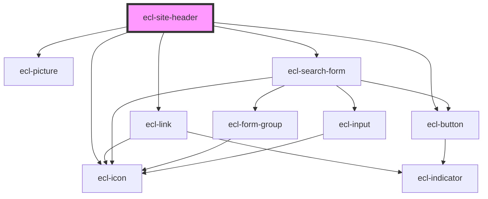

# ecl-site-header

<!-- Auto Generated Below -->

## Properties

| Property             | Attribute               | Description | Type      | Default                                                                        |
| -------------------- | ----------------------- | ----------- | --------- | ------------------------------------------------------------------------------ |
| `bannerTop`          | `banner-top`            |             | `string`  | `undefined`                                                                    |
| `bannerTopLink`      | `banner-top-link`       |             | `string`  | `undefined`                                                                    |
| `closeLabel`         | `close-label`           |             | `string`  | `undefined`                                                                    |
| `euLabel`            | `eu-label`              |             | `string`  | `undefined`                                                                    |
| `langCode`           | `lang-code`             |             | `string`  | `undefined`                                                                    |
| `language`           | `language`              |             | `string`  | `undefined`                                                                    |
| `languageAriaLabel`  | `language-aria-label`   |             | `string`  | `undefined`                                                                    |
| `languageBlock`      | `language-block`        |             | `boolean` | `false`                                                                        |
| `languageId`         | `language-id`           |             | `string`  | `undefined`                                                                    |
| `languageTitle`      | `language-title`        |             | `string`  | `undefined`                                                                    |
| `logged`             | `logged`                |             | `boolean` | `false`                                                                        |
| `loggedInText`       | `logged-in-text`        |             | `string`  | `undefined`                                                                    |
| `loginBlock`         | `login-block`           |             | `boolean` | `false`                                                                        |
| `loginLink`          | `login-link`            |             | `string`  | `undefined`                                                                    |
| `loginText`          | `login-text`            |             | `string`  | `undefined`                                                                    |
| `logo`               | `logo`                  |             | `string`  | `undefined`                                                                    |
| `logoAlt`            | `logo-alt`              |             | `string`  | `undefined`                                                                    |
| `logoSize`           | `logo-size`             |             | `string`  | `'l'`                                                                          |
| `logoTitle`          | `logo-title`            |             | `string`  | `undefined`                                                                    |
| `logoutLink`         | `logout-link`           |             | `string`  | `undefined`                                                                    |
| `logoutText`         | `logout-text`           |             | `string`  | `undefined`                                                                    |
| `noScript`           | `no-script`             |             | `boolean` | `false`                                                                        |
| `nonEuLabel`         | `non-eu-label`          |             | `string`  | `undefined`                                                                    |
| `searchBlock`        | `search-block`          |             | `boolean` | `true`                                                                         |
| `searchFormId`       | `search-form-id`        |             | `string`  | `` `ecl-site-header-search-form-${Math.random().toString(36).slice(2, 10)}` `` |
| `searchPlaceholder`  | `search-placeholder`    |             | `string`  | `undefined`                                                                    |
| `searchText`         | `search-text`           |             | `string`  | `undefined`                                                                    |
| `siteName`           | `site-name`             |             | `string`  | `undefined`                                                                    |
| `siteNameMobileOnly` | `site-name-mobile-only` |             | `boolean` | `false`                                                                        |
| `styleClass`         | `style-class`           |             | `string`  | `undefined`                                                                    |
| `theme`              | `theme`                 |             | `string`  | `undefined`                                                                    |

## Dependencies

### Depends on

- [ecl-link](../ecl-link)
- [ecl-picture](../ecl-picture)
- [ecl-icon](../ecl-icon)
- [ecl-button](../ecl-button)
- [ecl-search-form](../ecl-search-form)

### Graph

```mermaid
graph TD;
  ecl-site-header --> ecl-link
  ecl-site-header --> ecl-picture
  ecl-site-header --> ecl-icon
  ecl-site-header --> ecl-button
  ecl-site-header --> ecl-search-form
  ecl-link --> ecl-icon
  ecl-link --> ecl-indicator
  ecl-button --> ecl-indicator
  ecl-search-form --> ecl-form-group
  ecl-search-form --> ecl-input
  ecl-search-form --> ecl-button
  ecl-search-form --> ecl-icon
  ecl-form-group --> ecl-icon
  ecl-input --> ecl-icon
  style ecl-site-header fill:#f9f,stroke:#333,stroke-width:4px
```

----------------------------------------------

*Built with [StencilJS](https://stenciljs.com/)*
