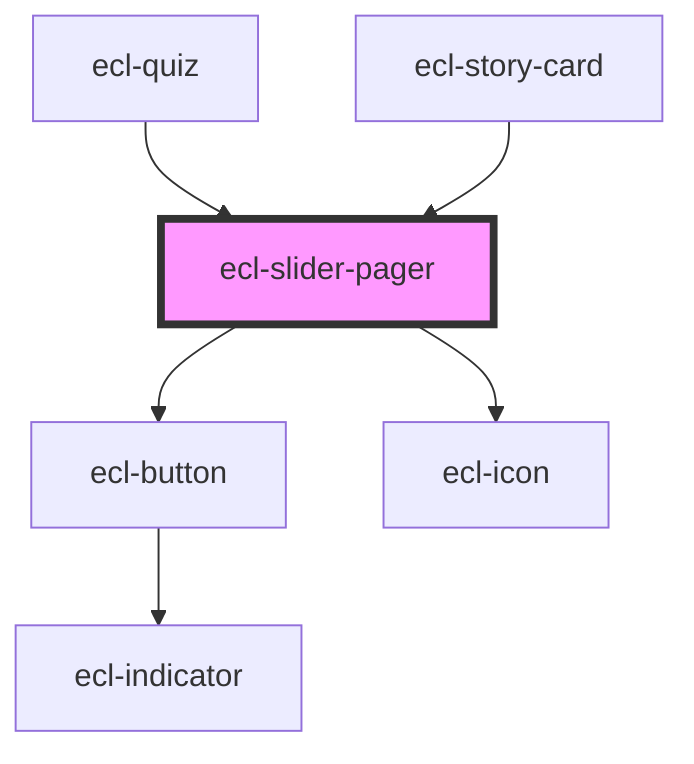

# ecl-slider-pager

<!-- Auto Generated Below -->

## Properties

| Property                | Attribute                 | Description | Type      | Default          |
| ----------------------- | ------------------------- | ----------- | --------- | ---------------- |
| `dotExtraClasses`       | `dot-extra-classes`       |             | `string`  | `''`             |
| `dots`                  | `dots`                    |             | `boolean` | `true`           |
| `dotsExtraClasses`      | `dots-extra-classes`      |             | `string`  | `''`             |
| `hideLabel`             | `hide-label`              |             | `boolean` | `false`          |
| `nextExtraAttributes`   | `next-extra-attributes`   |             | `string`  | `''`             |
| `nextExtraClasses`      | `next-extra-classes`      |             | `string`  | `''`             |
| `noScript`              | `no-script`               |             | `boolean` | `false`          |
| `pauseExtraClasses`     | `pause-extra-classes`     |             | `string`  | `''`             |
| `pauseIcon`             | `pause-icon`              |             | `string`  | `'pause-filled'` |
| `playExtraClasses`      | `play-extra-classes`      |             | `string`  | `''`             |
| `playIcon`              | `play-icon`               |             | `string`  | `'play-filled'`  |
| `playPause`             | `play-pause`              |             | `boolean` | `false`          |
| `prevExtraAttributes`   | `prev-extra-attributes`   |             | `string`  | `''`             |
| `prevExtraClasses`      | `prev-extra-classes`      |             | `string`  | `''`             |
| `size`                  | `size`                    |             | `string`  | `'s'`            |
| `srNext`                | `sr-next`                 |             | `string`  | `''`             |
| `srPause`               | `sr-pause`                |             | `string`  | `''`             |
| `srPlay`                | `sr-play`                 |             | `string`  | `''`             |
| `srPrev`                | `sr-prev`                 |             | `string`  | `''`             |
| `styleClass`            | `style-class`             |             | `string`  | `''`             |
| `templateDataAttribute` | `template-data-attribute` |             | `string`  | `''`             |
| `theme`                 | `theme`                   |             | `string`  | `undefined`      |

## Dependencies

### Used by

 - [ecl-quiz](../ecl-quiz)
 - [ecl-story-card](../ecl-story-card)

### Depends on

- [ecl-button](../ecl-button)
- [ecl-icon](../ecl-icon)

### Graph

----------------------------------------------

*Built with [StencilJS](https://stenciljs.com/)*
