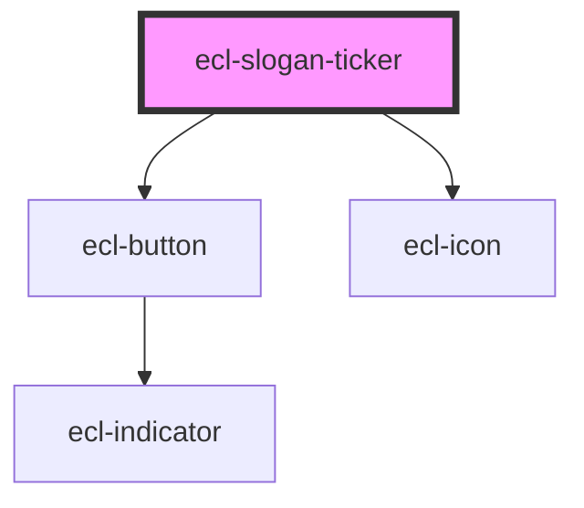

# ecl-slogan-ticker

<!-- Auto Generated Below -->

## Properties

| Property     | Attribute     | Description | Type      | Default     |
| ------------ | ------------- | ----------- | --------- | ----------- |
| `colorMode`  | `color-mode`  |             | `string`  | `''`        |
| `items`      | `items`       |             | `string`  | `'[]'`      |
| `noScript`   | `no-script`   |             | `boolean` | `false`     |
| `srPause`    | `sr-pause`    |             | `string`  | `''`        |
| `srPlay`     | `sr-play`     |             | `string`  | `''`        |
| `styleClass` | `style-class` |             | `string`  | `''`        |
| `theme`      | `theme`       |             | `string`  | `undefined` |

## Dependencies

### Depends on

- [ecl-button](../ecl-button)
- [ecl-icon](../ecl-icon)

### Graph

----------------------------------------------

*Built with [StencilJS](https://stenciljs.com/)*
