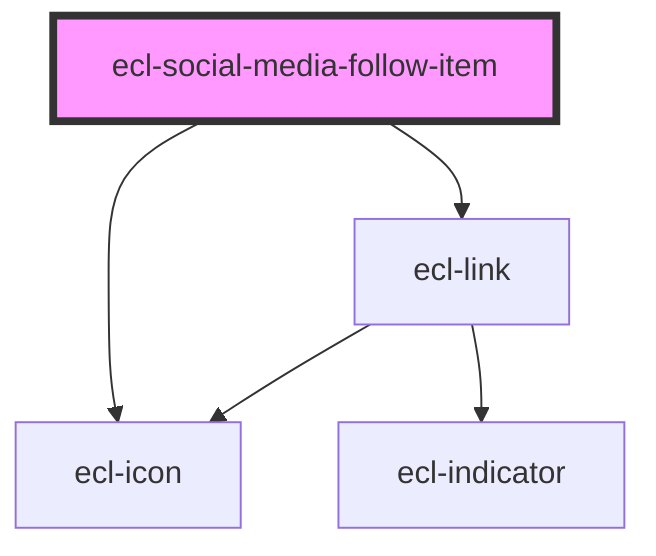

# ecl-social-media-follow

<!-- Auto Generated Below -->

## Properties

| Property     | Attribute     | Description | Type      | Default        |
| ------------ | ------------- | ----------- | --------- | -------------- |
| `color`      | `color`       |             | `string`  | `'monochrome'` |
| `family`     | `family`      |             | `string`  | `'networks'`   |
| `hideLabel`  | `hide-label`  |             | `boolean` | `false`        |
| `icon`       | `icon`        |             | `string`  | `undefined`    |
| `sharePath`  | `share-path`  |             | `string`  | `undefined`    |
| `styleClass` | `style-class` |             | `string`  | `undefined`    |
| `theme`      | `theme`       |             | `string`  | `undefined`    |

## Dependencies

### Depends on

- [ecl-link](../ecl-link)
- [ecl-icon](../ecl-icon)

### Graph

----------------------------------------------

*Built with [StencilJS](https://stenciljs.com/)*
