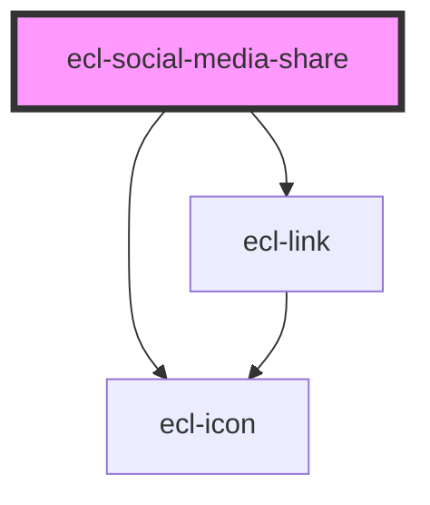

# ecl-social-media-share

<!-- Auto Generated Below -->

## Properties

| Property      | Attribute     | Description | Type     | Default        |
| ------------- | ------------- | ----------- | -------- | -------------- |
| `description` | `description` |             | `string` | `undefined`    |
| `items`       | `items`       |             | `string` | `undefined`    |
| `others`      | `others`      |             | `string` | `undefined`    |
| `styleClass`  | `style-class` |             | `string` | `undefined`    |
| `theme`       | `theme`       |             | `string` | `'ec'`         |
| `variant`     | `variant`     |             | `string` | `'horizontal'` |

## Dependencies

### Depends on

- [ecl-link](../ecl-link)
- [ecl-icon](../ecl-icon)

### Graph

----------------------------------------------

*Built with [StencilJS](https://stenciljs.com/)*
