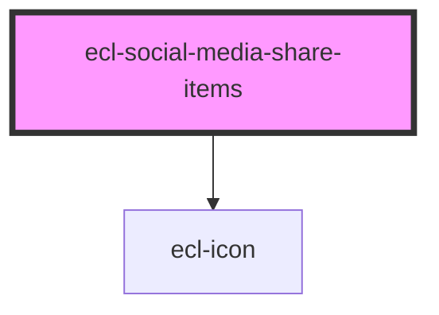

# ecl-social-media-share

<!-- Auto Generated Below -->

## Properties

| Property     | Attribute     | Description | Type     | Default     |
| ------------ | ------------- | ----------- | -------- | ----------- |
| `items`      | `items`       |             | `string` | `undefined` |
| `others`     | `others`      |             | `string` | `undefined` |
| `styleClass` | `style-class` |             | `string` | `undefined` |
| `theme`      | `theme`       |             | `string` | `'ec'`      |

## Dependencies

### Depends on

- [ecl-icon](../ecl-icon)

### Graph

----------------------------------------------

*Built with [StencilJS](https://stenciljs.com/)*
