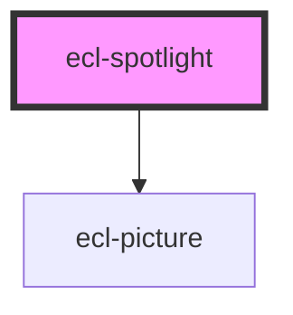

# ecl-spotlight

<!-- Auto Generated Below -->

## Properties

| Property     | Attribute     | Description | Type      | Default     |
| ------------ | ------------- | ----------- | --------- | ----------- |
| `colorMode`  | `color-mode`  |             | `string`  | `''`        |
| `credit`     | `credit`      |             | `string`  | `undefined` |
| `fontSize`   | `font-size`   |             | `string`  | `'m'`       |
| `fullWidth`  | `full-width`  |             | `boolean` | `false`     |
| `hasAnchor`  | `has-anchor`  |             | `boolean` | `true`      |
| `header`     | `header`      |             | `string`  | `undefined` |
| `image`      | `image`       |             | `string`  | `undefined` |
| `imageAlt`   | `image-alt`   |             | `string`  | `undefined` |
| `path`       | `path`        |             | `string`  | `undefined` |
| `styleClass` | `style-class` |             | `string`  | `''`        |
| `theme`      | `theme`       |             | `string`  | `undefined` |

## Dependencies

### Depends on

- [ecl-picture](../ecl-picture)

### Graph

----------------------------------------------

*Built with [StencilJS](https://stenciljs.com/)*
