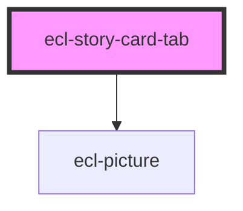

# ecl-story-card-tab

<!-- Auto Generated Below -->

## Properties

| Property      | Attribute      | Description | Type     | Default     |
| ------------- | -------------- | ----------- | -------- | ----------- |
| `order`       | `order`        |             | `string` | `'0'`       |
| `picture`     | `picture`      |             | `string` | `''`        |
| `styleClass`  | `style-class`  |             | `string` | `''`        |
| `teaserLabel` | `teaser-label` |             | `string` | `''`        |
| `theme`       | `theme`        |             | `string` | `undefined` |

## Dependencies

### Depends on

- [ecl-picture](../ecl-picture)

### Graph

----------------------------------------------

*Built with [StencilJS](https://stenciljs.com/)*
