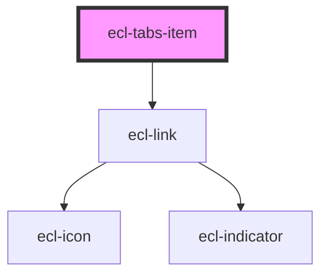

# ecl-tabs-item

<!-- Auto Generated Below -->

## Properties

| Property     | Attribute     | Description | Type      | Default                                                           |
| ------------ | ------------- | ----------- | --------- | ----------------------------------------------------------------- |
| `elId`       | `el-id`       |             | `string`  | `` `ecl-tabs-item-${Math.random().toString(36).substr(2, 9)}}` `` |
| `isCurrent`  | `is-current`  |             | `boolean` | `false`                                                           |
| `path`       | `path`        |             | `string`  | `''`                                                              |
| `styleClass` | `style-class` |             | `string`  | `''`                                                              |
| `theme`      | `theme`       |             | `string`  | `undefined`                                                       |

## Dependencies

### Depends on

- [ecl-link](../ecl-link)

### Graph

----------------------------------------------

*Built with [StencilJS](https://stenciljs.com/)*
