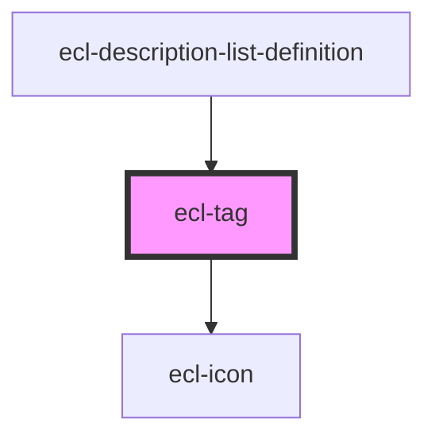

# ecl-tag

<!-- Auto Generated Below -->

## Properties

| Property     | Attribute     | Description | Type      | Default     |
| ------------ | ------------- | ----------- | --------- | ----------- |
| `external`   | `external`    |             | `boolean` | `false`     |
| `styleClass` | `style-class` |             | `string`  | `undefined` |
| `theme`      | `theme`       |             | `string`  | `'ec'`      |
| `url`        | `url`         |             | `string`  | `''`        |
| `variant`    | `variant`     |             | `string`  | `'display'` |

## Events

| Event       | Description | Type                   |
| ----------- | ----------- | ---------------------- |
| `removeTag` |             | `CustomEvent<boolean>` |

## Dependencies

### Used by

 - [ecl-description-list-definition](../ecl-description-list)

### Depends on

- [ecl-icon](../ecl-icon)

### Graph

----------------------------------------------

*Built with [StencilJS](https://stenciljs.com/)*
