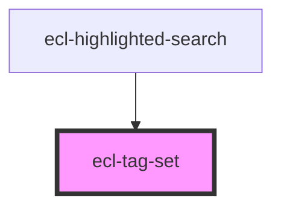

# ecl-tag

<!-- Auto Generated Below -->

## Properties

| Property     | Attribute     | Description | Type     | Default     |
| ------------ | ------------- | ----------- | -------- | ----------- |
| `colorMode`  | `color-mode`  |             | `string` | `undefined` |
| `styleClass` | `style-class` |             | `string` | `undefined` |
| `theme`      | `theme`       |             | `string` | `undefined` |

## Dependencies

### Used by

 - [ecl-highlighted-search](../ecl-highlighted-search)

### Graph

```mermaid
graph TD;
  ecl-highlighted-search --> ecl-tag-set
  style ecl-tag-set fill:#f9f,stroke:#333,stroke-width:4px
```

----------------------------------------------

*Built with [StencilJS](https://stenciljs.com/)*
