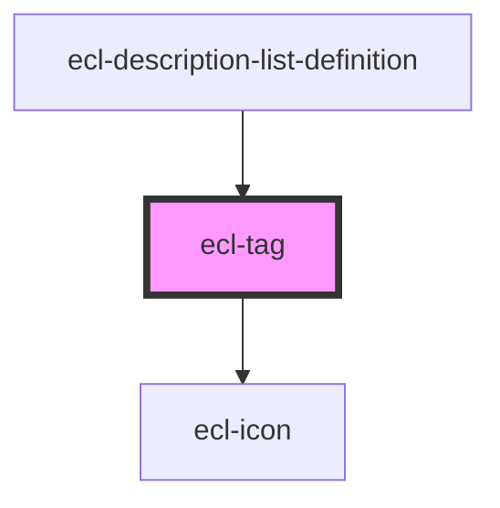

# ecl-tag

<!-- Auto Generated Below -->

## Properties

| Property     | Attribute     | Description | Type     | Default     |
| ------------ | ------------- | ----------- | -------- | ----------- |
| `colorMode`  | `color-mode`  |             | `string` | `undefined` |
| `styleClass` | `style-class` |             | `string` | `undefined` |
| `theme`      | `theme`       |             | `string` | `undefined` |

<<<<<<< HEAD
## Events

| Event       | Description | Type                   |
| ----------- | ----------- | ---------------------- |
| `removeTag` |             | `CustomEvent<boolean>` |

## Dependencies

### Used by

 - [ecl-description-list-definition](../ecl-description-list)

### Depends on

- [ecl-icon](../ecl-icon)

### Graph

```mermaid
graph TD;
  ecl-tag --> ecl-icon
  ecl-description-list-definition --> ecl-tag
  style ecl-tag fill:#f9f,stroke:#333,stroke-width:4px
```

=======
>>>>>>> 2b50edefbd44717fbb244a23ac3d50aab96dd85a
----------------------------------------------

*Built with [StencilJS](https://stenciljs.com/)*
