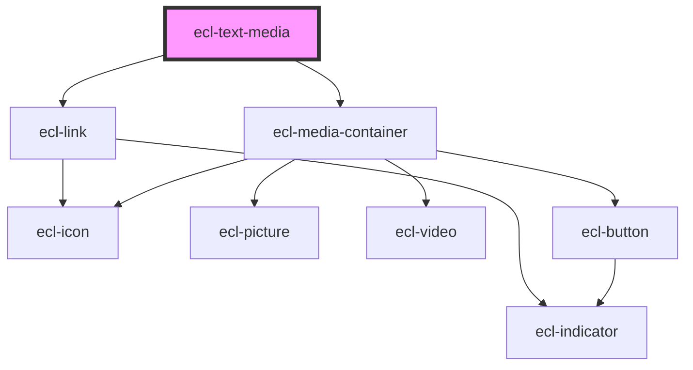

# ecl-text-media

<!-- Auto Generated Below -->

## Properties

| Property         | Attribute         | Description | Type      | Default                                                                                    |
| ---------------- | ----------------- | ----------- | --------- | ------------------------------------------------------------------------------------------ |
| `colorMode`      | `color-mode`      |             | `string`  | `undefined`                                                                                |
| `elId`           | `el-id`           |             | `string`  | `` `ecl-text-media-${Date.now().toString(16) + Math.random().toString(16).slice(2,10)}` `` |
| `fullWidth`      | `full-width`      |             | `boolean` | `false`                                                                                    |
| `hasDescription` | `has-description` |             | `boolean` | `true`                                                                                     |
| `hasMedia`       | `has-media`       |             | `boolean` | `true`                                                                                     |
| `image`          | `image`           |             | `string`  | `undefined`                                                                                |
| `itemTitle`      | `item-title`      |             | `string`  | `undefined`                                                                                |
| `linkLabel`      | `link-label`      |             | `string`  | `undefined`                                                                                |
| `linkPath`       | `link-path`       |             | `string`  | `undefined`                                                                                |
| `linkType`       | `link-type`       |             | `string`  | `'secondary-inverted'`                                                                     |
| `mediaAnchor`    | `media-anchor`    |             | `string`  | `undefined`                                                                                |
| `mediaCaption`   | `media-caption`   |             | `string`  | `undefined`                                                                                |
| `mediaCredit`    | `media-credit`    |             | `string`  | `undefined`                                                                                |
| `mediaPosition`  | `media-position`  |             | `string`  | `'right'`                                                                                  |
| `microTitle`     | `micro-title`     |             | `string`  | `undefined`                                                                                |
| `sources`        | `sources`         |             | `string`  | `undefined`                                                                                |
| `styleClass`     | `style-class`     |             | `string`  | `undefined`                                                                                |
| `theme`          | `theme`           |             | `string`  | `undefined`                                                                                |
| `tracks`         | `tracks`          |             | `string`  | `undefined`                                                                                |
| `variant`        | `variant`         |             | `string`  | `undefined`                                                                                |
| `videoTitle`     | `video-title`     |             | `string`  | `undefined`                                                                                |

## Dependencies

### Depends on

- [ecl-link](../ecl-link)
- [ecl-media-container](../ecl-media-container)

### Graph

----------------------------------------------

*Built with [StencilJS](https://stenciljs.com/)*
