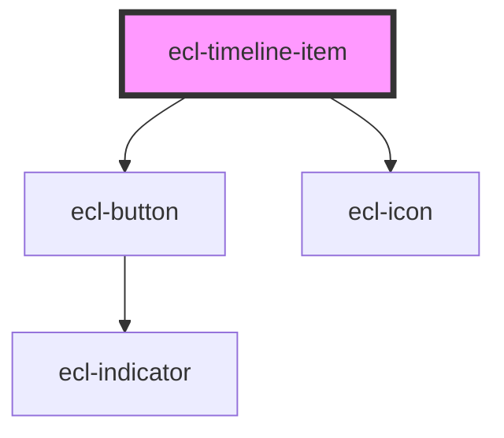

# ecl-timeline

<!-- Auto Generated Below -->

## Properties

| Property               | Attribute                | Description | Type      | Default                                                                                       |
| ---------------------- | ------------------------ | ----------- | --------- | --------------------------------------------------------------------------------------------- |
| `elId`                 | `el-id`                  |             | `string`  | `` `ecl-timeline-item-${Date.now().toString(16) + Math.random().toString(16).slice(2,10)}` `` |
| `isLast`               | `is-last`                |             | `boolean` | `false`                                                                                       |
| `itemTitle`            | `item-title`             |             | `string`  | `undefined`                                                                                   |
| `label`                | `label`                  |             | `string`  | `undefined`                                                                                   |
| `styleClass`           | `style-class`            |             | `string`  | `undefined`                                                                                   |
| `theme`                | `theme`                  |             | `string`  | `undefined`                                                                                   |
| `toggleLabelCollapsed` | `toggle-label-collapsed` |             | `string`  | `undefined`                                                                                   |
| `toggleLabelExpanded`  | `toggle-label-expanded`  |             | `string`  | `undefined`                                                                                   |
| `type`                 | `type`                   |             | `string`  | `undefined`                                                                                   |

## Dependencies

### Depends on

- [ecl-button](../ecl-button)
- [ecl-icon](../ecl-icon)

### Graph

```mermaid
graph TD;
  ecl-timeline-item --> ecl-button
  ecl-timeline-item --> ecl-icon
  ecl-button --> ecl-indicator
  style ecl-timeline-item fill:#f9f,stroke:#333,stroke-width:4px
```

----------------------------------------------

*Built with [StencilJS](https://stenciljs.com/)*
