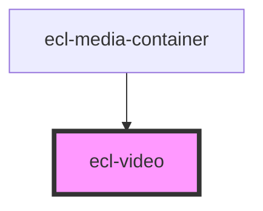

# ecl-video

<!-- Auto Generated Below -->

## Properties

| Property        | Attribute         | Description | Type      | Default     |
| --------------- | ----------------- | ----------- | --------- | ----------- |
| `autoplay`      | `autoplay`        |             | `boolean` | `false`     |
| `controls`      | `controls`        |             | `boolean` | `true`      |
| `loop`          | `loop`            |             | `boolean` | `false`     |
| `muted`         | `muted`           |             | `boolean` | `false`     |
| `poster`        | `poster`          |             | `string`  | `undefined` |
| `srVideoLabel`  | `sr-video-label`  |             | `string`  | `undefined` |
| `srVideoPlayer` | `sr-video-player` |             | `string`  | `undefined` |
| `styleClass`    | `style-class`     |             | `string`  | `''`        |
| `theme`         | `theme`           |             | `string`  | `undefined` |
| `videoTitle`    | `video-title`     |             | `string`  | `undefined` |
| `zoom`          | `zoom`            |             | `boolean` | `false`     |

## Dependencies

### Used by

 - [ecl-media-container](../ecl-media-container)

### Graph

----------------------------------------------

*Built with [StencilJS](https://stenciljs.com/)*
